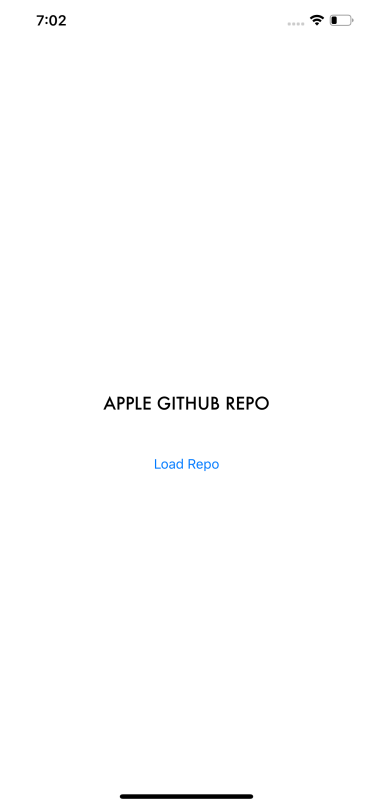
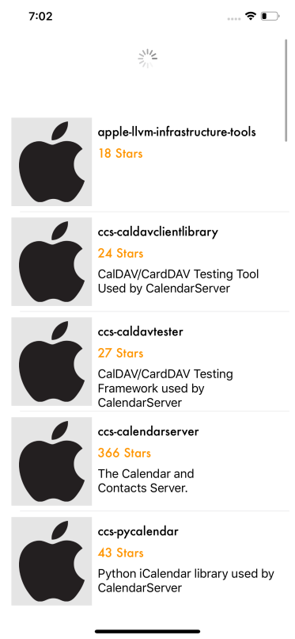
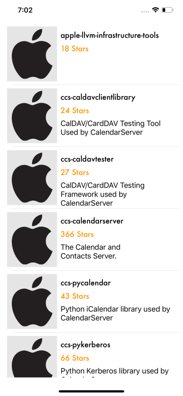

# githubAPI
Github Apple Repo using MVVM Architechture.

# Screenshots
 


# Installations : 
  - Clone or download this project
  - Open ```.xcworkspace``` file
  - If you need to refresh Pod file Go to project directory, then run ```pod install``` from your terminal
  - 3rd Party : RxSwift, Alamofire, Alamofire Image, SwiftLint, Qiuck, Nimble, RxTest
  
# Requirements : 
  - Xcode 11.3+
  - IOS 13.0+
  - Swift 5.0
  - Pod
  
# Features 
1. Load List Repo of Apple Github
2. Reload List
4. Code Quality using SwiftLint
5. Unit Test
6. UI Test
7. Clean Code, No error, No Warning.

# Contact 
Ask me : adiwibowoplus@gmail.com
